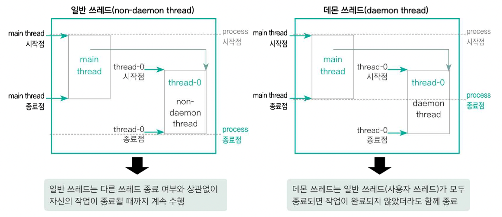

# thread_2

- 쓰레드의 속성

  ```
  public class default_class {
  	public static void main(String[] args) {
  		// 객체 참조하기, 쓰레드 개수 가져오기
  		Thread curThread = Thread.currentThread();
  		System.out.println("현재 스레드 이름 : " + curThread.getName());
  		System.out.println("동작 쓰레드 갯수 : " + Thread.activeCount());
  		
  		// 쓰레드 이름 자동 지정
  		for(int i = 0; i < 3; i++) {
  			Thread thread = new Thread();
  			System.out.println(thread.getName());
  			thread.start();
  		}
  		
  		// 쓰레드 이름 직접 지정
  		for(int i = 0; i < 3; i++) {
  			Thread thread = new Thread();
  			thread.setName(i + "번째 쓰레드");
  			System.out.println(thread.getName());
  			thread.start();
  		}
  		
  		// 쓰레드 개수 가져오기
  		System.out.println("동작하는 쓰레드의 개수 : " + Thread.activeCount());
  	}
  }
  ```

  ```
  현재 스레드 이름 : main
  동작 쓰레드 갯수 : 2
  Thread-0
  Thread-1
  Thread-2
  0번째 쓰레드
  1번째 쓰레드
  2번째 쓰레드
  동작하는 쓰레드의 개수 : 3
  ```

- 쓰레드의 우선순위

  ```
  class MyThread extends Thread {
      @Override
      public void run() {
              System.out.println(getName() + " 우선순위 : " + getPriority());
              try {
                  sleep(5000);
                  System.out.println(getName() + " end");
              } catch (InterruptedException e) {
                  System.out.println("InterruptedException");
              }
      }
  }
  
  public class default_class {
      public static void main(String[] args) {
          // CPU 코어 수
          System.out.println("코어 수 : " + Runtime.getRuntime().availableProcessors());
  
          // 우선순위 자동 지정
          for(int i = 0; i < 3; i++) {
              Thread thread = new MyThread();
              thread.start();
          }
          try {
              Thread.sleep(1000);
          } catch (InterruptedException e) {}
  
          // 우선순위 직접 지정
          for(int i = 0; i < 10; i ++) {
              Thread thread = new MyThread();
              thread.setName(i + "번째 쓰레드");
              if(i == 9) thread.setPriority(10);
              thread.start();
          }
      }
  }
  ```

  ```
  코어 수 : 10
  Thread-2 우선순위 : 5
  Thread-1 우선순위 : 5
  Thread-0 우선순위 : 5
  0번째 쓰레드 우선순위 : 5
  1번째 쓰레드 우선순위 : 5
  2번째 쓰레드 우선순위 : 5
  3번째 쓰레드 우선순위 : 5
  4번째 쓰레드 우선순위 : 5
  5번째 쓰레드 우선순위 : 5
  6번째 쓰레드 우선순위 : 5
  7번째 쓰레드 우선순위 : 5
  8번째 쓰레드 우선순위 : 5
  9번째 쓰레드 우선순위 : 10
  Thread-0 end
  Thread-2 end
  Thread-1 end
  0번째 쓰레드 end
  5번째 쓰레드 end
  9번째 쓰레드 end
  1번째 쓰레드 end
  7번째 쓰레드 end
  2번째 쓰레드 end
  4번째 쓰레드 end
  6번째 쓰레드 end
  3번째 쓰레드 end
  8번째 쓰레드 end
  ```

- 쓰레드의 데몬 설정

  - 일반적으로 쓰레드는 다른 쓰레드의 종료와 상관없이 자신의 작업을 마칠 때까지 실행
  
  - 데몬 쓰레드 : 일반 쓰레드가 종료되면 함께 종료되는 쓰레드
  
    - ex) 문서 편집 프로그램의 자동 저장 쓰레드
      - 프로그램이 켜져있으면 자동으로 쓰레드는 돌아가지만 프로그램이 꺼지면 이 쓰레드는 자동 종료
  
  
    
  
  - 일반 쓰레드
  
    .setDaemon(false) : 일반 쓰레드 설정
  
    ```
    class MyThread extends Thread {
        @Override
        public void run() {
            System.out.println(getName() + " : " + (isDaemon()? "데몬 쓰레드" : "일반 쓰레드"));
            for(int i = 0; i < 6; i++) {
                System.out.println(getName() + " : " + i + "초");
                try {
                    Thread.sleep(1000);
                } catch (InterruptedException e) {}
            }
        }
    }
    
    public class default_class {
        public static void main(String[] args) {
            // 일반 쓰레드
            Thread thread1 = new MyThread();
            thread1.setDaemon(false);			// 일반 쓰레드로 설정
            thread1.setName("thread1(일반 쓰레드)");
            thread1.start();
    
            // 4초 후 main() 쓰레드 종료
            try {
                Thread.sleep(4000);
            } catch (InterruptedException e) {}
            System.out.println("main Thread 종료");
        }
    }
    ```
  
    ```
    thread1(일반 쓰레드) : 일반 쓰레드
    thread1(일반 쓰레드) : 0초
    thread1(일반 쓰레드) : 1초
    thread1(일반 쓰레드) : 2초
    thread1(일반 쓰레드) : 3초
    main Thread 종료
    thread1(일반 쓰레드) : 4초
    thread1(일반 쓰레드) : 5초
    ```
  
    메인 쓰레드가 종료되어도 일반 쓰레드는 마저 실행되고 종료
  
  - 데몬 쓰레드
  
    .setDaemon(true)
  
    ```
    class MyThread extends Thread {
        @Override
        public void run() {
            System.out.println(getName() + " : " + (isDaemon()? "데몬 쓰레드" : "일반 쓰레드"));
            for(int i = 0; i < 6; i++) {
                System.out.println(getName() + " : " + i + "초");
                try {
                    Thread.sleep(1000);
                } catch (InterruptedException e) {}
            }
        }
    }
    
    public class default_class {
        public static void main(String[] args) {
            // 데몬 쓰레드
            Thread thread2 = new MyThread();
            thread2.setDaemon(true);			// 데몬 쓰레드로 설정
            thread2.setName("thread2(데몬 쓰레드)");
            thread2.start();
    
            // 4초 후 main() 쓰레드 종료
            try {
                Thread.sleep(4000);
            } catch (InterruptedException e) {}
            System.out.println("main Thread 종료");
        }
    }
    ```
  
    ```
    thread2(데몬 쓰레드) : 데몬 쓰레드
    thread2(데몬 쓰레드) : 0초
    thread2(데몬 쓰레드) : 1초
    thread2(데몬 쓰레드) : 2초
    thread2(데몬 쓰레드) : 3초
    main Thread 종료
    ```
  
    메인 쓰레드 종료 시, 데몬 쓰레드 종료
  
  - 데몬쓰레드가 죽지 않는 경우
  
    ```
    class MyThread extends Thread {
        @Override
        public void run() {
            System.out.println(getName() + " : " + (isDaemon()? "데몬 쓰레드" : "일반 쓰레드"));
            for(int i = 0; i < 6; i++) {
                System.out.println(getName() + " : " + i + "초");
                try {
                    Thread.sleep(1000);
                } catch (InterruptedException e) {}
            }
        }
    }
    
    public class default_class {
        public static void main(String[] args) {
            // 일반 쓰레드
            Thread thread1 = new MyThread();
            thread1.setDaemon(false);			// 일반 쓰레드로 설정
            thread1.setName("thread1(일반 쓰레드)");
            thread1.start();
    
            // 데몬 쓰레드
            Thread thread2 = new MyThread();
            thread2.setDaemon(true);            // 데몬 쓰레드로 설정
            thread2.setName("thread2(데몬 쓰레드)");
            thread2.start();
    
            // 4초 후 main() 쓰레드 종료
            try {
                Thread.sleep(4000);
            } catch (InterruptedException e) {}
            System.out.println("main Thread 종료");
        }
    }
    ```
  
    ```
    thread1(일반 쓰레드) : 일반 쓰레드
    thread2(데몬 쓰레드) : 데몬 쓰레드
    thread1(일반 쓰레드) : 0초
    thread2(데몬 쓰레드) : 0초
    thread2(데몬 쓰레드) : 1초
    thread1(일반 쓰레드) : 1초
    thread1(일반 쓰레드) : 2초
    thread2(데몬 쓰레드) : 2초
    thread1(일반 쓰레드) : 3초
    thread2(데몬 쓰레드) : 3초
    main Thread 종료
    thread2(데몬 쓰레드) : 4초
    thread1(일반 쓰레드) : 4초
    thread2(데몬 쓰레드) : 5초
    thread1(일반 쓰레드) : 5초
    ```
  
    메인 쓰레드는 종료되어도 일반 쓰레드는 종료되지 않았기 때문에 데몬 쓰레드가 종료되지 않는 것이다.

