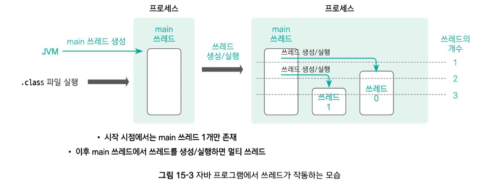

# thread

- 프로그램 : 하드디스크에 저장된 파일들의 모임

- 프로세스 : 메모리상에 로딩된 프로그램

  - 프로그램 전체를 한꺼번에 로딩하는 것이 아니라 그때그때 필요한 부분만을 동적 할당
  - 동일한 프로그램을 메모리에 2번 로딩하면 2개의 프로세스 동작 -> 멀티 프로세스
    - ex) 워드 프로그램을 2개 작동할 시

- 쓰레드 : CPU를 사용하는 최소 단위

  - 프로세스는  CPU를 사용하여 동작
  - 더 정확하게 프로세스 안에 쓰레드가  CPU를 사용하여 동작

  - 쓰레드를 사용하지 않는 프로세스는 존재X

- 자바 프로그램에서의 쓰레드

  - 

  1. .class 파일 실행
  2. JVM - main 쓰레드 생성, main 쓰레드 1개만이 존재
     - main() 메서드 동작
  3. 위 그림과 같이 메인 메서드 안에서 2개의 쓰레드를 생성해 동시에 2개 이상의 쓰레드가 동작
     - 이를 멀티 쓰레드 프로세스라 함

- 멀티 쓰레드의 필요성

  - ex) 비디오프레임과 자막을 단일 스레드로 출력한 경

    ```
    public class default_class {
    	public static void main(String[] argd) {
    		int[] intArray = {1,2,3,4,5};
    		String[] strArray = {"하나", "둘", "셋", "넷", "다섯"};
    		for (int i = 0; i < intArray.length; i++) {
    			System.out.println("(비디오 프레임)" + intArray[i]);
    			try {
    				Thread.sleep(200);
    			} catch (InterruptedExceptiom e) {
    			
    			}
    		}
    		for(int i = 0; i < strArray.length; i++) {
    			System.out.println("(자막번호)" + strArray[i]);
    			try {
    				Thread.sleep(200);
    			} catch (InterruptedException e) {
    			
    			}
    		}
    	}
    }
    ```

    ```
    (비디오 프레임)1
    (비디오 프레임)2
    (비디오 프레임)3
    (비디오 프레임)4
    (비디오 프레임)5
    (자막번호)하나
    (자막번호)둘
    (자막번호)셋
    (자막번호)넷
    (자막번호)다섯
    ```

    위 코드는 단일 쓰레드를 사용하여 실행한 결과이다.

    영화를 단일 쓰레드처럼 이용하면 영상이 다 끝난 후에야 자막이 실행될 것이다.

- 멀티 쓰레드

  - 동시성 : 매우 짧은 간격으로 교차 실행하기 때문에 사용자는 마치 동시에 실행되는 것처럼 보이는 것
    - CPU 코어는 1개, 처리할 작업 수 2개
      - 이 때 CPU는 각 작업 쓰레드의 요청 작업을 번갈아가면서 실행한다.
      - 매우 짧은 간격으로 교차 실행하기 때문에 사용자는 마치 동시에 실행되는 것처럼 보이는 것
  - 병렬성 : 코어들이 각각 작업을 각각 할당하여 동작하는 것
    - CPU 코어는 2개, 처리할 작업 수 2개
      - 각 코어가 작업을 하나씩 할당하여 실행

  - 작업 6개, 코어 2개
    - 동시성과 병렬성을 동시 적용

-----

- 쓰레드의 생성 및 실행 방법

  1. Thread 클래스를 상속받아 run() 메서드 재정의

     - ```
       class MyThread extends Thread {						// 클래스 정의, run 오버라이딩
       	public void run() {
       		// 쓰레드 작업 내용
       	}
       }
       
       public class default_class {
       	public static void main(String[] args) {
       		Thread myThread = new MyThread();			// 객체 생성
       		myThread.start();											// 쓰레드 실행
       	}
       }
       ```

       start() 메서드 : 새로운 쓰레드 생성/추가하기 위한 모든 준비 + 새로운 쓰레드 위에 run() 실행

     - 2개의 쓰레드 활용

       비디오 프레임과 자막 활용
       
       ```
       class SMIFileThread extends Thread {
       	public voic run() {
       		// 자막
       		String[] strArray = {"하나", "둘", "셋", "넷", "다섯"};
       		try {
       			// 프레임 먼저 출력이 되야 하기 때문에 잠깐의 틈
       			Thread.slepp(10);
       		} catch (InterruptedException e) {}
       
       		// 자막 출력
       		for (int i = 0; i < strArray.length; i++) {
       			System.out.println("(자막 번호)" + strArray[i]);
       			try {
       				// 다음 비디오 프레임이 출력되고 출력해야하기 때문에 잠깐의 틈					
       				Thread.sleep(200);
       			} catch (InterruptedException e) {}
       		}
       	}
       }
       public class default_class {
       	public static void main(String[] args) {
       		// 자막 쓰레스 생성 및 시작
       		Thread smiFileThread = new SMIFileThread();
       		smiFileThread.start();
       		// 비디오 프레임
       		int[] intArray = {1, 2, 3, 4, 5};
       		
       		for (int i = 0; i < intArray.length; i++) {
       			System.out.println("(비디오 프레임)" + intArray[i]);
       			System.out.println();
       			try {
       				// 자막도 출력되야 하기 때문에 잠깐의 틈
       				Thread.sleep(200);
       			} catch (InterruptedException e) {}
       		}
       	}
       }
       ```
       
       ```
       (비디오 프레임)1
       (자막 번호)하나
       (비디오 프레임)2
       (자막 번호)둘
       (비디오 프레임)3
       (자막 번호)셋
       (비디오 프레임)4
       (자막 번호)넷
       (비디오 프레임)5
       (자막 번호)다섯
       ```
  
  2. Runnable 인터페이스 구현 객체를 생성한 후 Thread 생성자로 Runnable 객체 전달
  
     - ```
       class MyRunnable implements Runnable {
       	public void rub() {
       		// 쓰레드 작업 내용
       	}
       }
       
       public class default_class {
       	public static void main(String[] args) {
       		Runnable r = new MyRunnable();
       		
       		// Runnable 인터페이스에서는 start() 메서드가 없기에 사용
       		Thread thread = new Thread(r);
       		
       		myThread.start();
       	}
       }
       ```
  
     - 3개의 쓰레드 활용
  
       ```
       class SMIFileRunnable implements Runnable {
           public void run() {
               // 자막 번호 저장
               String[] strArray = {"하나", "둘", "셋", "넷", "다섯"};
               // 0.01초 뒤에 시작
               try {
                   Thread.sleep(10);
               } catch (InterruptedException e) {}
       
               // 자박 번호 출력
               for (int i = 0; i < strArray.length; i++) {
                   System.out.println("(자막 번호)" + strArray[i]);
                   try {
                       Thread.sleep(200);
                   } catch (InterruptedException e) {}
               }
           }
       }
       
       class VideoFileRunnable implements Runnable {
           public void run() {
               // 비디오 프레임 번호 저장
               int[] intArray = {1, 2, 3, 4, 5};
               // 비디오 프레임 번호 출력
               for (int i = 0; i < intArray.length; i++) {
                   System.out.println("(프레임 번호)" + intArray[i]);
                   try {
                       Thread.sleep(200);
                   } catch (InterruptedException e) {}
               }
           }
       }
       
       public class default_class {
           public static void main(String[] args) {
               // 자막 출력 객체 생성
               Runnable smiFileRunnable = new SMIFileRunnable();
               Thread thread1 = new  Thread(smiFileRunnable);
               //자막 출력 스레드 실행
               thread1.start();
       
               Runnable videoFileRunnable = new VideoFileRunnable();
               Thread thread2 = new Thread(videoFileRunnable);
               thread2.start();
           }
       }
       ```
  
       총 3개의 쓰레드 사용 : 메인쓰레드 / 자막 번호 출력 쓰레드 / 비디오 프레임 번호 출력 쓰레드
  
       -----
  
  - 이너 클래스를 활용한 쓰레드 객체 생성 및 실행
  
    - ```
      public class default_class {
      	public static void main(String[] args) {
      		// 자막 번호를 출력하는 쓰레드의 익명 이너 클래스 정의
      		Thread thread1 = new Thread(new Runnable() {
      			public void run() {
      				// 자막 번호 출력
      				String[] strArray = {"하나", "둘", "셋", "넷", "다섯"};
      				try {
      					Thread.sleep(10);
      				} catch (InterruptedException e) {}
      				for (int i = 0; i < strArray.length; i++) {
      					System.out.println("(자막번호)" + strArray[i]);
      					try {
      						Thread.sleep(200);
      					} catch (InterruptedException e) {}
      				}
      		});
      		
      		Thread thread2 = new Thread(new Runnable() {
      			public
      		})
      	}
      }
      ```
  
  


